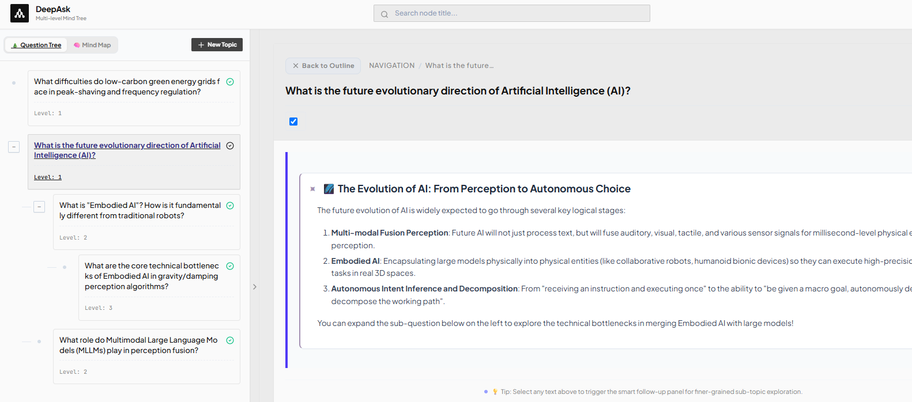
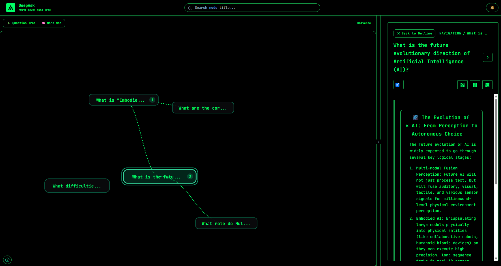

# DeepAsk: Multi-level Mind Tree Platform

This is a top-down, progressively expanding tree-based question and multi-level mind tree platform. The system supports infinite levels of derivative sub-questions, node folding toggles, smooth side navigation lines, and is deeply integrated with Google Gemini and other AI models to provide fully automated node answering and in-depth heuristic sub-question generation.



## 🌟 Features

- **Infinite-Level Logic Tree**: Breaks down complex problems into multi-level sub-questions, clearly displaying the logical context.
- **Deep AI Integration**: Supports one-click AI-generated in-depth answers for nodes, and can heuristically generate lower-level sub-questions based on the current node's context.
- **Multi-Model Support**: Built-in support for Google Gemini, OpenAI, DeepSeek, Anthropic (Claude), MiniMax, and other large language models.
- **Text Selection Follow-up**: Supports selecting specific text within the answer pane; the AI will automatically generate related sub-question recommendations for you.
- **Bilingual & Smart Adaptation**: Full bilingual support (Chinese & English) for all UI components, buttons, menus, and modals. The system automatically initializes and synchronizes the built-in sample question tree to match the selected display language.
- **Responsive Modern UI**: Built with React 18, combined with Tailwind CSS for beautiful typography, and includes multiple built-in rendering themes (e.g., Zen, Geeker).
- **Privacy & Security First**: If users prefer not to provide a global backend Key, they can bind their own API keys for various models in the frontend unified settings. Key information is securely saved within the browser's local sandbox (`LocalStorage`).

## 🛠️ Tech Stack

- **Frontend**: React, Vite, Tailwind CSS, Framer Motion, Lucide React
- **Backend**: Node.js, Express (for CORS and securely proxying various model APIs)
- **Language**: TypeScript (Full Stack)

## ⚙️ Environment Variables

Before deploying, ensure you have [Node.js](https://nodejs.org/) installed.

### 1. Install Dependencies

```bash
# Install all frontend and backend dependencies
npm install
```

### 2. Configure Environment Variables

There is a `.env.example` file in the project root. Before running, you can create a `.env` file (optional, if frontend users provide their own keys).

```bash
cp .env.example .env
```

In the `.env` file, configure the following variables:

```env
# Example of a core LLM Key
GEMINI_API_KEY="YOUR_GEMINI_API_KEY"

# Whether to force clients to provide their own API Key (prevents anonymous users from abusing backend quota)
# "false" (default) means if the frontend key is empty, it falls back to the global backend Key;
# "true" means strict blocking, forcing users to configure their own Key in the frontend UI.
REQUIRE_CLIENT_API_KEY="false"

# You can also configure other Provider API Keys
OPENAI_API_KEY=""
DEEPSEEK_API_KEY=""
ANTHROPIC_API_KEY=""
MINIMAX_API_KEY=""
MINIMAX_BASE_URL="https://api.minimaxi.com/v1"
```

## 🚀 Local Development

Start the full-stack development server containing frontend Vite and backend Express (running with `tsx`):

```bash
npm run dev
```

After starting, visit `http://localhost:3000` in your browser to preview the project.

## 📦 Production Deployment

In a production environment, you need to first build the frontend Vite React code into static files, bundle the backend TypeScript code, and then run it natively via `node`.

```bash
# 1. Execute global build and bundle (frontend generates to dist/, backend compiles to dist/server.cjs)
npm run build

# 2. Start the production-grade Node.js server
npm start
```

The server will start on the default port. At this point, your Express node not only handles API proxying but also proxies frontend static resource requests.

This deployment is highly suitable for Docker-containerized cloud hosting platforms (e.g., Google Cloud Run, AWS App Runner, Railway, etc.).
